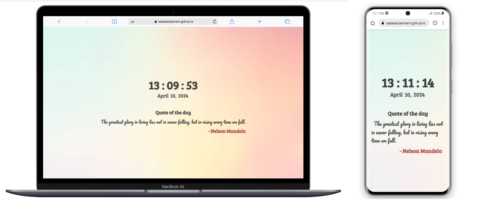

<h1 align="center">Homepage | Time & Quote of the Day</h1>

  <a href="#-project">Project</a>&nbsp;&nbsp;&nbsp;|&nbsp;&nbsp;&nbsp;
  <a href="#-features">Features</a>&nbsp;&nbsp;&nbsp;|&nbsp;&nbsp;&nbsp;
  <a href="#-preview">Preview</a>

  

## 💻 Project
This project is a digital clock with a motivational quote of the day. It displays the current time and updates every second. Additionally, it fetches a new quote each day and displays it alongside the current time.

## ✨ Technologies used:
- HTML
- CSS
- JavaScript

## ⚙️ Features
- Real-time digital clock display
- Dynamic greeting message based on the time of day
- Fetches a new motivational quote daily
- Responsive design

## 🔗 Preview
<a href="https://isabelaolsemann.github.io/Homepage/" target="_blank">View Homepage</a>

---
This project was created by Isabela Olsemann (2023).
